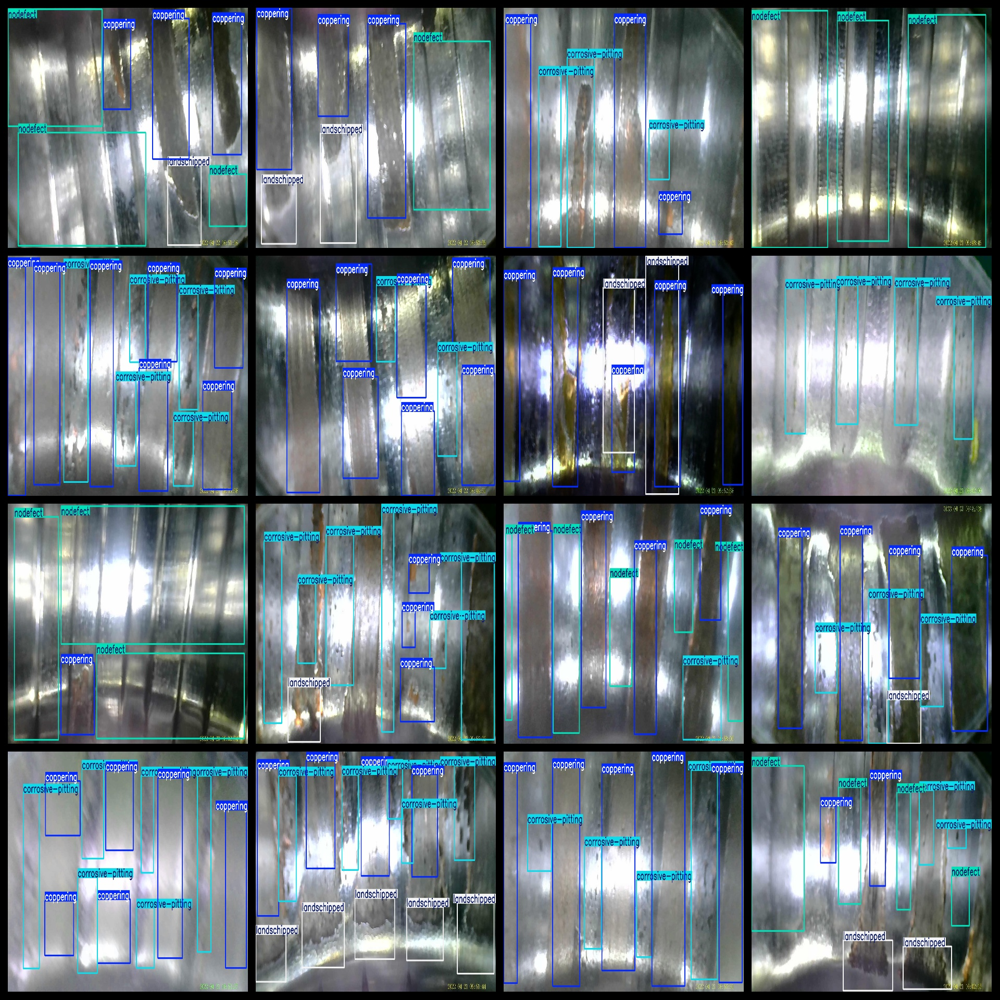
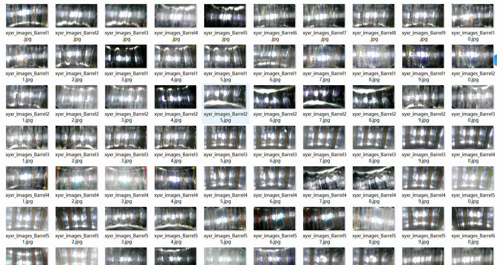

# [Object Detection] Bucket Defect Dataset 1000 Images in YOLO+VOC Format

[Object Detection] Bucket Defect Dataset: 1000 Images in YOLO+VOC Format

Dataset format: VOC format + YOLO format

The compressed package contains three folders, each storing images, xml, and txt files.

In the JPEGImages folder, there are a total of 1000 jpg images.

In the Annotations folder, there are a total of 1000 xml files.

In the labels folder, there are a total of 1000 txt files.

There are a total of 4 categories in the labels: ["coppering", "corrosive-pitting", "landschipped", "nodefect"].

["Plating", "Pitting", "Scaling", "Defective"]

Each category has a number of bounding boxes (note that the order of categories in the YOLO format does not match this, but rather follows the classes.txt file in the labels folder).

- coppering: 3809 bounding boxes
- corrosive-pitting: 2745 bounding boxes
- landschipped: 1020 bounding boxes
- nodefect: 429 bounding boxes

Total bounding boxes: 8003

Image resolution: Clear

Image enhancement: No

Label shape: Rectangular box used for target detection recognition

Important note: There are no guarantees regarding the accuracy or weight files of the trained models provided by this dataset. The dataset only provides accurate and reasonable annotations.

Annotation and image details are as follows:
## Images

---

Here is a pay link on Stripe (https://buy.stripe.com/3cs8yP7sY87d0vu9AB). Please contact me lonlonago@foxmail.com after funding $89, and I will send you a complete data files, thank you!

